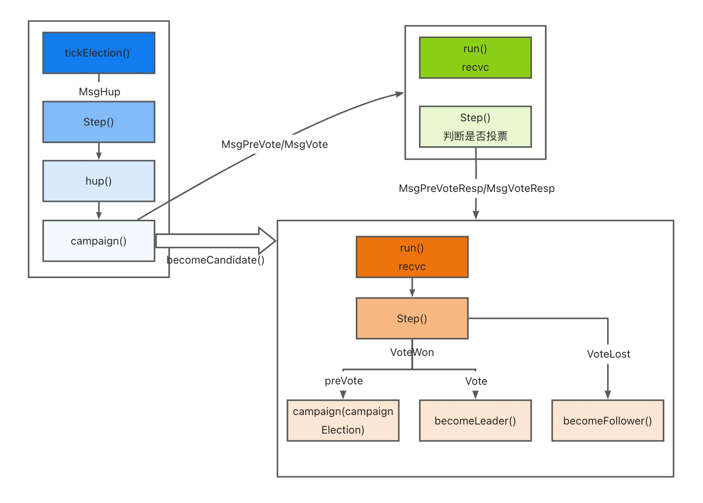
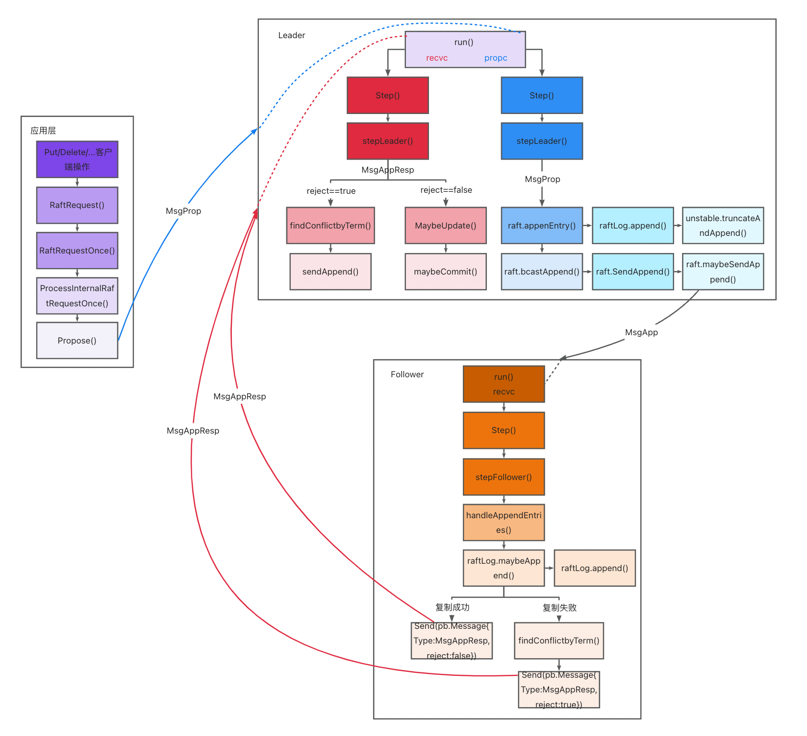

# 实现Raft算法

本实验基于etcd代码改动而成。主要任务为实现etcd中Raft算法。

此次实验分为两部分，包括领导者选举及日志复制。请根据注释提示，完成代码填充，所有需要填充的代码均在./raft/raft.go文件中。

在完成实验后，可运行 ./raft/raftLab_test.sh以检验是否实现正确

## 1 前期准备

请确保已经安装 go>=1.19, make

## 2 领导者选举

领导者选举部分注释标志为RaftLab Election。请根据注释的步骤，根据选举的逻辑将代码补充完整。



follower节点tick函数推进当前时间计数，如果发现一段时间内都未收到领导者消息，触发选举条件。其转变状态为candidate，并向集群中广播请求投票消息MsgVote。节点收到请求投票消息MsgVote，根据term和日志判断是否可以投票，回复投票消息MsgVoteResp。当candidate可以收到多数节点的投票消息，则成功当选，转变状态为leader并广播通知权威。

## 3 日志复制

日志复制部分注释标志为RaftLab Replication，请根据注释的步骤，根据日志复制的逻辑将代码补充完整。



当上层发送MsgProp，说明有新的写入，触发开始进行日志项复制。领导者收到MsgProp消息，将新的日志项加入本地，然后向集群中广播日志复制消息MsgApp。其他节点收到日志复制消息MsgApp，调用handleAppendEntries函数尝试将复制到本地，将复制结果回复给领导者msgAppResp。当领导者收到多数节点复制成功的回复时，提交日志项，并将结果广播给其他节点。

## 4 测试

```bash
cd raft
./raftLab_test.sh
```
